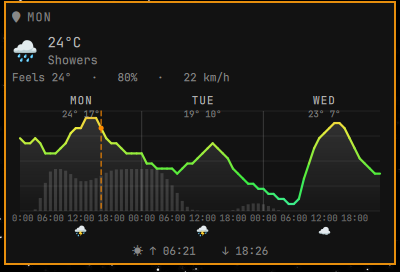

# Omaweather

<p align="center">
  <strong>The <a href="https://v2.wttr.in">v2.wttr.in</a> chart, living in your Omarchy bar.</strong><br>
  Emoji and temperature up top. The full colored forecast on click.
</p>

<p align="center">
  
</p>

<p align="center">
  <a href="https://omarchy.org"></a>
  <a href="LICENSE"></a>
  <a href="https://github.com/chubin/wttr.in"></a>
</p>

Same picture you get from `curl v2.wttr.in` — temperature curve, rain bars, wind, moon — drawn with your bar font and theme colors.

No sudo or pkexec is required.

## Install

```sh
omarchy plugin add https://github.com/Gedankenn/omaweather.git --enable
```

It lands in the center of the bar, next to the clock. Move it anywhere:

```sh
omarchy bar move io.github.gedankenn.omaweather --section right
```

## What you get

| In the bar | In the popup |
| --- | --- |
| Weather emoji + temperature | Three-day temperature graph |
| Tooltip with wind and humidity | Precipitation, wind, moon phase |
| Refreshes every 15 minutes | Sunrise, sunset, and location |

## Usage

| Input | Action |
| :---: | --- |
| Left click | Open or close the forecast |
| Click the city name | Search and pick a city |
| Enter | Same city search, while the panel is open |
| Empty search | Back to IP geolocation |
| Middle click | Refresh now |
| Right click | Desktop notification with current conditions |
| `r` | Refresh while the panel is open |
| Escape | Close the search, or the panel |

## Configure

The simple way: open the popup, click the city name, type, pick a result. That stores the name plus coordinates so the next fetch hits the right place.

Settings also live on the widget entry — the Omarchy config UI, or:

```sh
omarchy bar set io.github.gedankenn.omaweather location "Pato Branco"
omarchy bar set io.github.gedankenn.omaweather refreshMinutes 20
```

| Key | Default | Meaning |
| --- | --- | --- |
| `location` | empty | City name or `lat,lon`. Empty uses IP geolocation. |
| `refreshMinutes` | `15` | How often to refetch. Minimum 1. |

The plugin does not overwrite user configuration. Removing it only drops its bar entry.

## Data

Forecasts come from [wttr.in](https://github.com/chubin/wttr.in) over HTTPS, fetched with `curl`. Download size is capped before it reaches the shell (`head -c`, plus `--max-filesize`). Remote fields are clipped and treated as plain text in the bar and footer. Metric units.

Needs a network connection. If wttr.in is slow or down, the last good reading stays on the bar and the plugin retries.

## Remove

```sh
omarchy plugin remove io.github.gedankenn.omaweather
```

## License

[MIT](LICENSE) © Fabio Slika Stella
